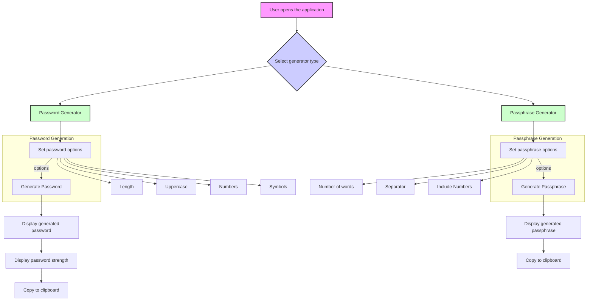

```mermaid
    graph TD
        A[User opens the application] --> B{Select generator type};
        B --> C[Password Generator];
        B --> D[Passphrase Generator];

        C --> E[Set password options];
        E --> F[Length];
        E --> G[Uppercase];
        E --> H[Numbers];
        E --> I[Symbols];

        J[Generate Password] --> K[Display generated password];
        K --> L[Display password strength];
        L --> M[Copy to clipboard];

        D --> N[Set passphrase options];
        N --> O[Number of words];
        N --> S[Separator];
        N --> T[Include Numbers];

        P[Generate Passphrase] --> Q[Display generated passphrase];
        Q --> R[Copy to clipboard];

        subgraph Password Generation
            E -- options --> J;
        end

        subgraph Passphrase Generation
            N -- options --> P;
        end

        style A fill:#f9f,stroke:#333,stroke-width:2px
        style B fill:#ccf,stroke:#333,stroke-width:2px
        style C fill:#cfc,stroke:#333,stroke-width:2px
        style D fill:#cfc,stroke:#333,stroke-width:2px
```